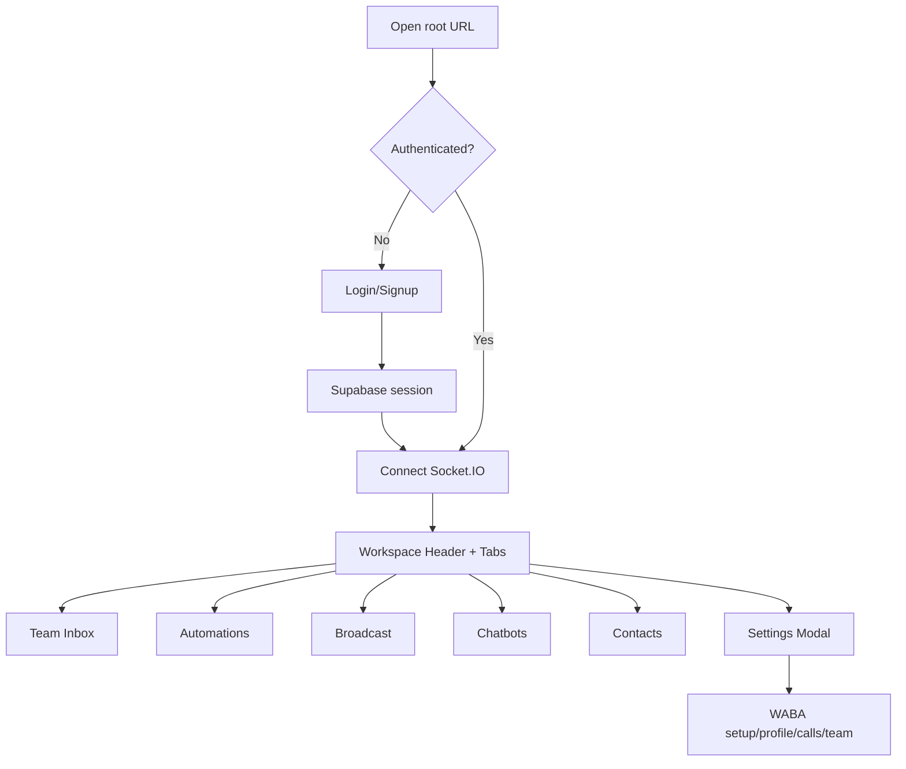

# Overview

## What This App Does

QMessage is a multi-tenant WhatsApp business messaging platform built on the official Meta WhatsApp Cloud API.

Core capabilities:

- Onboard and configure WhatsApp Business phone numbers (Embedded Signup + manual setup).
- Run real-time team inbox operations via Socket.IO.
- Manage automation workflows and quick replies.
- Build/send templates, including scheduled broadcast campaigns.
- Manage company-level settings (branding, fallback behavior, team users, UI feature toggles).
- Provide superadmin monitoring (`/myadmin`) across all companies.
- Optional webstore/public pages and optional AI assistant response generation.

## Target Users

- **Company owner/admin/agent**: operate inbox, automations, templates, settings for one tenant/company.
- **Superadmin**: monitor and govern all companies via MyAdmin endpoints/UI.
- **API integrator**: use API-key endpoints and addon webhook extension endpoints.

## Key Feature Areas

- Authentication and company-scoped access control (Supabase Auth + metadata + role checks).
- Team Inbox (contacts, messages, assignments, human takeover, media send/download).
- Workflow engine (keyword and flow-step automations).
- Template management and broadcast scheduling.
- WhatsApp Business configuration (business profile, call settings, registration, connected businesses).
- Company media storage (optional Cloudflare R2) for quick replies, app logo, and chat attachments.
- Superadmin monitoring and company UI governance.

## Main Screens and Flows

### Public

- `GET /` -> Login/Signup SPA (`dashboard/src/Login.tsx`).
- `GET /support`, `/privacy-policy`, `/terms-and-conditions` -> public information pages.
- `GET /:companyId/store` and `/customixie` -> public store/landing pages.

### Authenticated Workspace (single-page app)

- Team Inbox
- Automations
- Broadcast
- Chatbot settings
- Contacts
- More (Settings and Analytics launcher)

### Settings Modal Sections

- Connect WhatsApp
- Manual setup
- Register number
- Outgoing webhooks
- Call settings (conditionally shown)
- Business profile
- App logo
- Team users
- Connected clients/businesses (superadmin)

### Superadmin

- `GET /myadmin` web monitor (HTML app) and JSON APIs under `/api/admin/*`.

## User Journey Diagram

