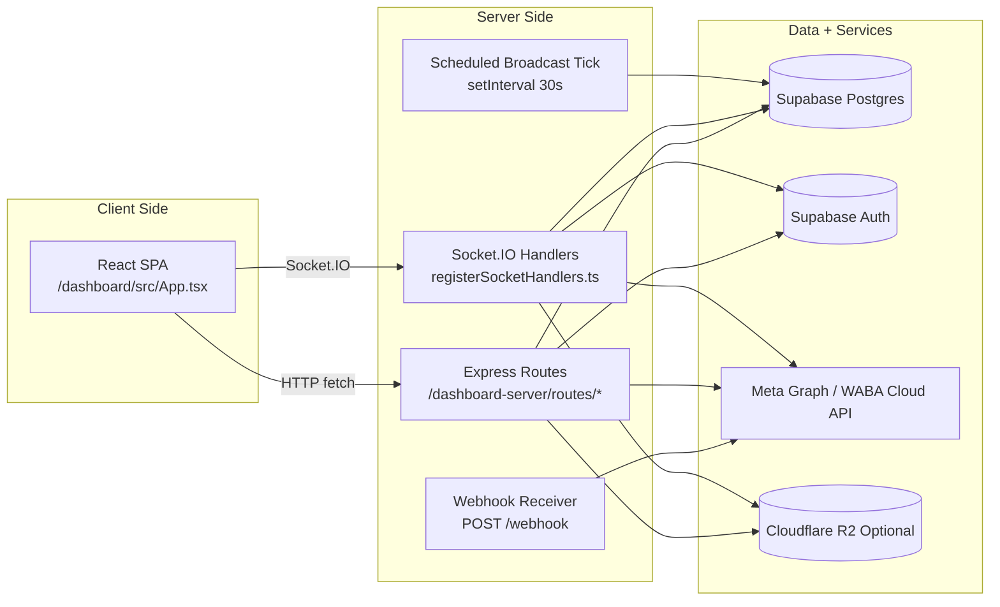
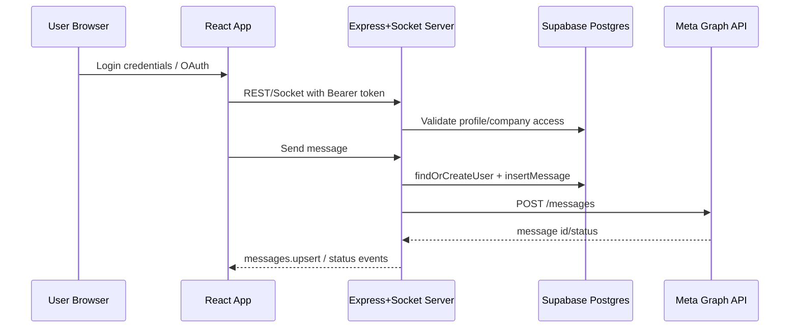

# Architecture

## High-Level System Design

The system is a single Node process that hosts:

- REST API routes
- Socket.IO realtime channel
- WhatsApp webhook receiver
- Background scheduled broadcast worker
- Static frontend serving (production)

Core composition entrypoint: `dashboard-server.ts`.

## Runtime Topology

## Request and Data Flow

### 1) Login and Session

1. User signs in via Supabase in frontend (`dashboard/src/Login.tsx`).
2. Frontend stores session/access token.
3. App opens Socket.IO with `auth.token`.
4. Backend validates token via `supabaseAuth.auth.getUser(token)` and enforces tenant/subdomain match.

### 2) Workspace Data

1. Client emits `switchProfile` after socket connect.
2. Server emits `profiles.update`, `contacts.update`, `messages.history`.
3. Client state is updated in `App.tsx` (contacts/messages/profile selections).

### 3) Message Send

1. Frontend emits `sendMessage` (or `sendTemplate`).
2. Backend resolves company/profile/client and recipient user record.
3. Backend sends through WABA client (`src/waba/client.ts`).
4. Message is persisted to `messages` table and broadcast to connected company room.

### 4) Inbound Webhook

1. Meta POSTs payload to `/webhook`.
2. Signature verification via app secret(s).
3. Payload parsed (`parseWabaWebhook`) into messages/status/calls.
4. Store updates + workflow processing + socket fanout + addon webhooks.

## Client ? API ? Database Interaction

## External Services

- **Supabase**: auth + tenant data.
- **Meta Graph API**: templates, profile settings, media upload, calls, messaging.
- **Cloudflare R2 (optional)**: signed URL upload/download for company-owned media assets.
- **Cloudflared (optional local edge tunnel)**: publishes local service to `2fast.xyz`.

## Architectural Patterns in Use

- Route-module registration with dependency injection (`register*Routes(app, ctx)`).
- Multi-tenant scoping via `company_id` and profile ownership checks.
- Event-driven updates to frontend using socket events.
- API-key extension endpoints for external automation via addon module.
- Graceful fallback behavior when migrations/columns are missing (explicit `503` with migration hints).
