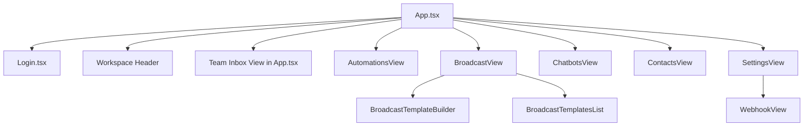

# Features & Pages

This app is mostly a **single-page workspace** with internal sections, plus public and superadmin pages.

## Route and View Map

| Path | Access | Purpose | Primary Components |
|---|---|---|---|
| `/` | Public/Auth | Login, signup company, Google sign-in | `Login.tsx` |
| `/support` | Public | Support info page | `publicInfoRoutes.ts` renderer |
| `/privacy`, `/privacy-policy` | Public | Privacy policy | `publicInfoRoutes.ts` renderer |
| `/terms`, `/terms-and-conditions` | Public | Terms page | `publicInfoRoutes.ts` renderer |
| `/:companyId/store` | Public | Storefront HTML page for company products | `storeRoutes.ts` HTML renderer |
| `/:companyId/store.json` | Public | Storefront JSON data endpoint | `storeRoutes.ts` |
| `/customixie` | Public | Custom landing page | `storeRoutes.ts` |
| `/myadmin` | Superadmin UI | Global company monitor and controls | HTML app from `dashboard-server.ts` |
| `/my` | Superadmin API | JSON admin summary | `dashboard-server.ts` |

## Workspace Shell (SPA)

The authenticated UI is controlled by:

- `activeView`: `dashboard | chatflow | settings | admin`
- `workspaceSection`: `team-inbox | automations | broadcast | chatbots | contacts | more`

Source: `dashboard/src/App.tsx`.

---

## 1) Login / Signup

**Logical path:** `/`

### What it does

- Sign in existing user with email/password.
- Create new company owner account via backend public endpoint.
- Google OAuth login (sign-in only).
- Enforces company/subdomain match.

### Components

- `dashboard/src/Login.tsx`

### API calls

- `POST /api/public/signup-company`
- Supabase Auth client methods:
  - `auth.signInWithPassword`
  - `auth.signInWithOAuth(provider: 'google')`

### Data/state flow

- On successful login, parent `App.tsx` receives Supabase `Session` and initializes socket connection.

---

## 2) Team Inbox

**Logical section:** `workspaceSection = team-inbox`

### What it does

- Shows contacts/chats/messages for active profile.
- Sends text/media/template messages.
- Shows media previews and download flow.
- Handles contact tags, assignment, human takeover, clear chat.

### Components

- Main UI in `App.tsx`
- Modals: `NewChatModal`, `AddProfileModal`, `EditProfileModal`, onboarding modal

### Socket events used

Inbound:

- `profiles.update`
- `connection.update`
- `messages.upsert`
- `messages.history`
- `message.status`
- `contacts.update`
- `messages.cleared`
- `mediaDownloaded`
- `calls.update`

Outbound:

- `switchProfile`
- `refreshMessages`
- `sendMessage`
- `sendTemplate`
- `downloadMedia`
- `contact.update`
- `contact.assign`
- `contact.human_takeover`
- `clearChat`
- `startWorkflow`

### REST calls used

- `GET /api/waba/call-permissions`
- `GET /api/company/team-users`
- `GET /api/company/quick-replies`

### State/data flow

- Socket updates hydrate in-memory `contacts`, `allMessages`, `profiles`, unread counters.
- Active profile and selected chat drive filtered message rendering and actions.

---

## 3) Automations

**Logical section:** `workspaceSection = automations`

### What it does

- Manage workflow list and enabled status.
- Configure trigger keyword and run-on-new-chat behavior.
- Manage quick replies and fallback behavior.
- Configure conversational automation and reminder settings.

### Components

- `features/workspace/AutomationsView.tsx`

### API calls

- `GET /api/flows`
- `POST /api/flows`
- `GET /api/company/quick-replies`
- `POST /api/company/quick-replies`
- `GET /api/company/fallback-settings`
- `POST /api/company/fallback-settings`
- `GET /api/waba/conversational-automation`
- `POST /api/waba/conversational-automation`
- `GET /api/waba/window-reminder`
- `POST /api/waba/window-reminder`

---

## 4) Broadcast

**Logical section:** `workspaceSection = broadcast`

### What it does

- Build templates (utility/marketing/authentication flow support).
- Browse template library.
- Schedule template broadcasts.

### Components

- `features/workspace/BroadcastView.tsx`
- `BroadcastTemplateBuilder.tsx`
- `BroadcastTemplatesList.tsx`

### API calls

- `GET /api/waba/templates`
- `POST /api/waba/templates/utility`
- `POST /api/waba/templates/marketing`
- `POST /api/waba/templates/authentication`
- `POST /api/waba/templates/authentication/upsert`
- `POST /api/waba/templates/authentication/send`
- `POST /api/waba/templates/send`
- `POST /api/waba/marketing-messages/send`
- `GET /api/waba/scheduled-broadcasts`
- `POST /api/waba/scheduled-broadcasts`
- `DELETE /api/waba/scheduled-broadcasts/:id`
- `POST /api/waba/template-media/upload-handle`

---

## 5) Chatbots (AI)

**Logical section:** `workspaceSection = chatbots`

### What it does

- Per-company AI assistant settings (model, prompt, memory, token limits, API key).
- Test/generate AI replies with optional memory context from message history.

### Components

- `features/workspace/ChatbotsView.tsx`

### API calls

- `GET /api/company/ai/settings`
- `POST /api/company/ai/settings`
- `POST /api/company/ai/generate`

---

## 6) Contacts

**Logical section:** `workspaceSection = contacts`

### What it does

- Search contacts and open chat.
- Assign/unassign contacts to team users.

### Components

- `features/workspace/ContactsView.tsx`

### APIs/events

- Reads live contacts from socket stream (`contacts.update`).
- Assignment mutations emit `contact.assign`.

---

## 7) Settings Modal

**Logical view:** `activeView = settings`

### What it does

- WABA onboarding and embedded signup.
- Manual configuration and number registration.
- Business profile update (about/address/description/email/websites/vertical/profile picture handle).
- Call settings fetch/update.
- App logo and company media upload.
- Team user management.
- Addon outgoing webhook management.
- Connected clients and connected businesses (superadmin-specific blocks).

### Components

- `features/workspace/SettingsView.tsx`
- `WebhookView.tsx`

### API calls (selected)

- `GET /api/waba/embedded-signup/url`
- `POST /api/waba/manual-config`
- `GET /api/waba/registration/config`
- `GET /api/waba/registration/phone-numbers`
- `POST /api/waba/registration/request-code`
- `POST /api/waba/registration/verify-code`
- `POST /api/waba/registration/register`
- `POST /api/waba/registration/profile`
- `GET /api/waba/business-profile`
- `POST /api/waba/business-profile`
- `GET /api/waba/call-settings`
- `POST /api/waba/call-settings`
- `GET /api/company/app-logo`
- `POST /api/company/app-logo`
- `POST /api/company/media/upload-url`
- `GET /api/company/team-users`
- `POST /api/company/team-users/invite`
- `PATCH /api/company/team-users/:userId/role`
- `PATCH /api/company/team-users/:userId/department`
- `GET /addon/admin/webhooks`
- `POST /addon/admin/webhooks`
- `DELETE /addon/admin/webhooks`
- `GET /api/waba/connected-client-businesses` (superadmin)

---

## 8) Analytics

**Logical entry:** `workspaceSection = more` -> Analytics card

### What it does

- Aggregates message/response/workflow metrics by date range and optional tag.

### Components

- Analytics UI in `App.tsx`

### API calls

- `GET /api/analytics`

---

## 9) Superadmin Monitor

**Path:** `/myadmin`

### What it does

- Bootstrap/setup superadmin account.
- Superadmin login.
- Company-level metrics (profiles, contacts, workflows, WABA configs, messages).
- Company UI hidden-features controls.

### API calls

- `GET /api/admin/setup-status`
- `POST /api/admin/setup`
- `POST /api/admin/login`
- `GET /api/admin/summary`
- `POST /api/admin/company-ui`

---

## Component Hierarchy (Key Screens)

