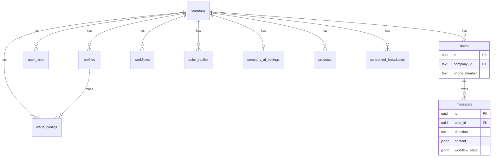

# Database

## Database Platform

- Supabase Postgres
- Supabase Auth for users
- App tables in `public` schema

## Active Tables (Code-Referenced)

The following tables are actively referenced in server code:

- `company`
- `profiles`
- `user_roles`
- `users`
- `messages`
- `workflows`
- `quick_replies`
- `waba_configs`
- `waba_oauth_states`
- `company_ai_settings`
- `products`
- `scheduled_broadcasts`

## Entity Relationship Diagram

## Key Table Notes

### `company`

Known fields used by app:

- `id`, `name`, `email`, `created_at`
- Fallback settings: `fallback_text`, `fallback_limit`
- UI controls: `ui_hidden_features`
- Branding/logo: `app_logo_storage`, `app_logo_asset_key`, `app_logo_mime_type`, `app_logo_size_bytes`, `app_logo_filename`
- Webstore: `webstore_enabled`, `webstore_title`, `webstore_subtitle`, `webstore_brand_color`, `webstore_theme`, `webstore_show_logo`, `webstore_hero_badge`

### `profiles`

Known fields used by app:

- `id`, `user_id`, `company_id`, `name`, `created_at`, `unreadCount`

### `user_roles`

- `user_id`, `company_id`, `role`, `created_at`
- Used for tenant authorization and role hierarchy (`owner/admin/agent`).

### `users`

Represents messaging contacts per company.

Known fields used by app:

- identity: `id`, `company_id`, `phone_number`, `name`
- routing/workflow: `tags`, `template_attributes`
- assignment: `assigned_to_user_id`, `assigned_to_name`, `assigned_to_color`, `assigned_at`
- timing windows: `last_inbound_at`, `last_window_reminder_at`, CTA fields

### `messages`

Known fields:

- `id`, `user_id`, `direction`, `content`, `workflow_state`, `created_at`

### `workflows`

Known fields:

- `id`, `company_id`, `trigger_keyword`, `actions`, `builder`, `name`, `enabled`, `run_on_new_chat`

### `quick_replies`

Known fields:

- `id`, `company_id`, `shortcut`, `text`, `message_type`
- media extensions: `media_url`, `media_filename`, `media_storage`, `media_asset_key`, `media_mime_type`, `media_size_bytes`, `media_items`

### `waba_configs`

Known fields:

- `profile_id`, `company_id`, `phone_number_id`, `waba_id`, `business_id`, `client_business_id`
- token fields: `access_token`, `system_user_token`, `token_source`, `access_token_expires_at`
- app/webhook fields: `app_id`, `app_secret`, `verify_token`, `api_version`, `enabled`
- reminder fields: `window_reminder_enabled`, `window_reminder_minutes`, `window_reminder_text`

### `waba_oauth_states`

Used for OAuth state tracking during embedded signup callback handling.

### `company_ai_settings`

Per-company AI settings:

- `company_id` (PK/FK)
- `enabled`, `model`, `system_prompt`, `temperature`, `max_tokens`
- `memory_enabled`, `memory_messages`, `api_key`, `updated_at`, `updated_by`

### `products`

Webstore catalog items:

- `id`, `company_id`, `name`, `slug`, `sku`, `description`
- `price`, `currency`, `stock_qty`, `image_url`, `is_active`, `created_at`, `updated_at`

### `scheduled_broadcasts`

Queue table for future template sends:

- `id`, `company_id`, `profile_id`, `name`, `template_name`, `language`
- `components`, `recipients`, `scheduled_at`, `status`
- `sent_count`, `failed_count`, `last_error`, `processed_at`, timestamps

## RLS (Row Level Security)

Migration: `20260304_enable_rls_core_tables.sql`

- Enables RLS on core tenant tables.
- Defines helper function `public.current_company_ids()`.
- Adds **SELECT policies** for authenticated users by company membership.

Key implication:

- User-scoped reads are restricted by membership.
- Many writes/administrative operations in server use service-role client and explicit server-side authorization checks.

## Indexes and Performance

Migration: `20260304_query_perf_indexes.sql`

Indexes created for high-frequency paths:

- `messages(user_id, created_at)`
- workflow-state subset index
- company scoping indexes on `users`, `profiles`, `workflows`, `quick_replies`, `waba_configs`
- role/profile lookup indexes (`user_roles`, `profiles`)

## Migration Notes and Gaps

- Core base-table creation migrations are not fully present in this repository.
- Invoice tables were added in older migration and removed in `20260406_drop_invoice_objects.sql`.
- If migrations are partially applied, API endpoints may return targeted `503` errors with migration instructions.

## Database Data Flow Examples

### Inbound Message

1. Webhook parsed.
2. `findOrCreateUser(company_id, phone_number)` in `users`.
3. `insertMessage()` into `messages`.
4. Optional workflow state updates in subsequent message rows.

### Broadcast Scheduling

1. UI inserts row into `scheduled_broadcasts`.
2. Background tick claims due jobs by status transition `scheduled -> processing`.
3. Sends template per recipient.
4. Updates final status (`sent/partial/failed`) with counters.
