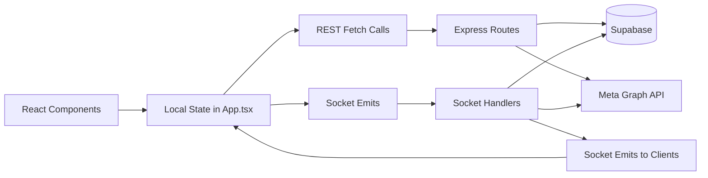

# State Management

## Frontend State Strategy

The frontend uses **React local state + hooks** (no Redux/Zustand).

Primary state owner: `dashboard/src/App.tsx`.

Major state domains:

- Session/auth state (`session`, `authChecking`, `hostAuthError`)
- Connection state (`socket`, `connectionStatus`, reconnect/recovery timers)
- Workspace navigation (`activeView`, `workspaceSection`, `broadcastSection`)
- Data caches (`profiles`, `contacts`, `allMessages`, `workflows`, `quickReplies`)
- UI state (modals, toasts, filters, search, draft inputs)
- Media download/upload state (`mediaCache`, `mediaDownloadProgress`)

## Data Fetching Strategy

### Pull-based REST fetches

- Used for settings/configuration and list data (flows, templates, team users, analytics, etc.).
- Triggered by `useEffect`, user actions, and section changes.

### Push-based realtime updates

- Socket event stream updates chat/contact/profile/message status live.
- Socket connection is (re)initialized whenever session changes.

### Recovery behavior

- App has timeout-based socket recovery when profile load/chat sync stalls.
- Logs and toast feedback are used for user-visible status.

## Shared Hook Utilities

- `useElementSize` in `dashboard/src/hooks/useElementSize.ts` for layout/virtualized sizing.
- UI composition helpers from component-level local state and memoization.

## Backend State and Caching

- In-memory maps in `WabaRegistry` cache config/client instances with refresh interval.
- In-memory sets/maps for scheduled broadcast processing locks and runtime dedupe.
- Addon webhook queue persisted to local JSON file (`addon_webhook_queue.json`).

## Persistence Model

- Source of truth for tenant/business data is Supabase.
- Local filesystem (`data/`) stores supplementary runtime files (flows/sessions/webhook queue and similar artifacts).

## State/Data Flow Diagram

## Concurrency and Safety Patterns

- Server uses status transition + id tracking for scheduled jobs (`scheduled -> processing`).
- Client media download state uses timer refs and dedupe sets to prevent repeated fetch/progress loops.
- Backend route handlers often enforce company/profile ownership before data writes.
