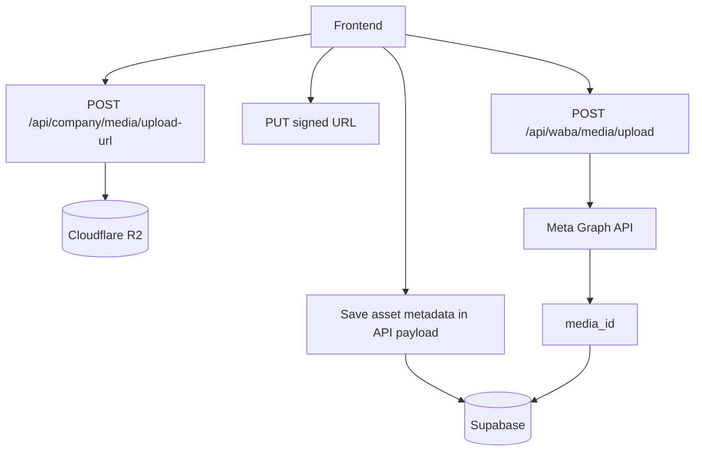

# Storage

## Storage Surfaces

1. **Supabase Postgres**: structured app data (messages, users, workflows, etc.).
2. **Meta/WhatsApp media store**: uploaded media IDs via Graph API `/{phone-number-id}/media`.
3. **Cloudflare R2 (optional)**: company-owned assets with signed URLs.
4. **Local filesystem (`data/`)**: addon queue and runtime JSON artifacts.

## Cloudflare R2 Integration

Implemented in `src/services/r2-storage.ts`.

### Supported upload purposes

- `quick_reply`
- `chat_message`
- `app_logo`

### Supported message types

- `image`
- `video`
- `document`

### Security controls

- Signed upload URL + signed download URL flow.
- Asset keys are company-scoped under:
  - `companies/<company-id>/<purpose>/<type>/<timestamp-nonce-filename>`
- Server validates key ownership with `assertCompanyAssetKey(companyId, assetKey)`.

### API flow

1. Frontend requests signed URL:
   - `POST /api/company/media/upload-url`
2. Frontend uploads directly to R2 using returned URL/headers.
3. Frontend stores metadata (`assetKey`, mime/size/filename) in entity endpoint payloads.
4. Server can generate temporary download URL from `assetKey`.

## App Logo Storage

- Company stores logo metadata in `company` table columns (`app_logo_*`).
- If logo is R2-backed, API returns signed `logo_url` for frontend display.
- Endpoints:
  - `GET /api/company/app-logo`
  - `POST /api/company/app-logo`

## Quick Reply Media Storage

Quick replies support two storage modes:

- `external`: direct `media_url`
- `r2`: internal `media_asset_key` + signed URL generation at read time

Migration requirements:

- `20260408_quick_replies_media_support.sql`
- `20260408_quick_replies_r2_storage.sql`

## WhatsApp Media Upload (Meta-hosted)

Frontend helper: `dashboard/src/features/media/uploadToWabaMedia.ts`

Endpoint:

- `POST /api/waba/media/upload`

Result:

- returns `mediaId`, then messages can be sent by media ID (`sendMediaById` path).

## Local File Storage

### Root runtime

- `src/config.ts` uses `data/` directory by default.

### Wonderpark runtime

- `wonderpark/config.ts` uses `WONDERPARK_DATA_DIR` (default `data-wonderpark`).

### Files seen in repo/runtime

- webhook configs and queue (`addon_webhooks.json`, `addon_webhook_queue.json`)
- flow/session JSON artifacts

## Storage Diagram

