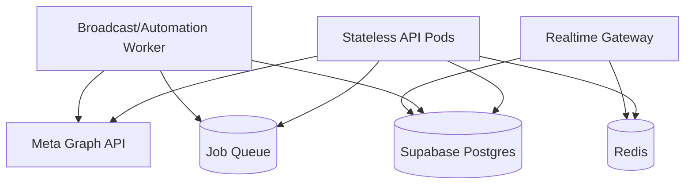

# Future Improvements

## Priority Roadmap

## P0 - Security and Access Safety

1. Remove hardcoded fallback Supabase URL/key defaults in source (`src/supabase.ts`, frontend fallback keys).
2. Enforce strict CORS origins (replace wildcard).
3. Add centralized secret validation at startup and fail fast on missing critical env vars.
4. Add audit logging for superadmin actions (`/api/admin/*`).

## P1 - Reliability and Correctness

1. Add a baseline schema snapshot migration for fresh-project bootstrapping.
2. Move scheduled broadcast worker to a dedicated queue/worker process for horizontal scale.
3. Add idempotency safeguards for webhook processing and message status updates.
4. Add robust retry and circuit-breaker policy for Graph API transient failures.

## P2 - Developer Experience and Maintainability

1. Add committed `.env.example` (sanitized) and setup validator script.
2. Split oversized `dashboard/src/App.tsx` into feature-level state containers/hooks.
3. Split `dashboard-server.ts` into smaller modules (auth, admin, webhook, bootstrapping).
4. Add OpenAPI spec generation for REST endpoints.

## P3 - Test and Quality Coverage

1. Add backend API integration tests (auth, tenancy, role guards).
2. Add socket contract tests for key events.
3. Add frontend component tests (Login, Settings, Inbox critical actions).
4. Add migration smoke tests in CI against disposable DB.

## P4 - Product and UX

1. Add robust error boundary + fallback UI in frontend.
2. Improve first-time onboarding guided checks (verify required migrations/permissions live).
3. Add localized content support for UI and templates.
4. Add dashboard observability (Sentry/OpenTelemetry/metrics dashboard).

## Scaling Concerns

- In-process interval workers can duplicate work under multi-instance deployment.
- Socket + REST in one process can create contention under high traffic.
- File-backed addon queue is not ideal for clustered deployments.

## Suggested Target Architecture (mid-term)

