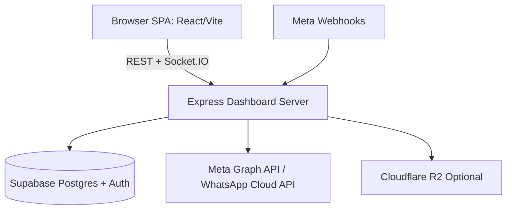

# QMessage Documentation

This documentation set describes the `Qmessage-Main` repository as implemented in code on **2026-04-09**.

## Document Map

1. [Overview](./01-overview.md)
2. [Tech Stack](./02-tech-stack.md)
3. [Architecture](./03-architecture.md)
4. [Project Structure](./04-project-structure.md)
5. [Setup & Installation](./05-setup-installation.md)
6. [Environment Variables](./06-environment-variables.md)
7. [Features & Pages](./07-features-pages.md)
8. [Authentication](./08-authentication.md)
9. [Database](./09-database.md)
10. [API & Services](./10-api-services.md)
11. [State Management](./11-state-management.md)
12. [Storage](./12-storage.md)
13. [Edge Functions & Backend Logic](./13-edge-backend-logic.md)
14. [Testing](./14-testing.md)
15. [Deployment](./15-deployment.md)
16. [Troubleshooting](./16-troubleshooting.md)
17. [Future Improvements](./17-future-improvements.md)
18. [Supabase Clone Runbook](./18-supabase-clone-migration.md)
19. [Capacitor Native Push Setup](./capacitor-native-push.md)
20. [Native App Setup (RN Migration)](./native-app-setup.md)

## Quick Start

```bash
npm install
npm run dev
```

Frontend: `http://localhost:5173`  
Backend API/Socket: `http://localhost:3000`

## High-Level Diagram



## Source-of-Truth Notes

- This documentation is code-derived from repository files.
- Where historical migrations are missing/partial, sections explicitly call out assumptions and gaps.
- Sensitive values in local `.env` are intentionally not repeated here.
